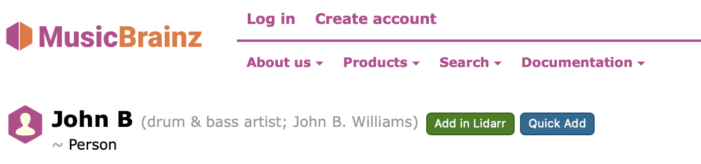

# MusicBrainz -> Lidarr Safari Userscript

This userscript adds `Add in Lidarr` and `Quick Add` buttons to MusicBrainz results/pages so you can send entries straight to Lidarr without manual copy/paste.



## Requirements

- Safari + [Userscripts extension](https://apps.apple.com/us/app/userscripts/id1463298887)
- Access to a running Lidarr instance

## Install

1. Open `MusicBrainz -> Lidarr Quick Add.user.js`.
2. Edit the metadata block and replace the placeholder match line:
   - From: `// @match        https://lidarr.example.com/*`
   - To: your actual Lidarr URL, for example `// @match        https://lidarr.my-domain.com/*`
3. Save the script.
4. Import/enable it in Safari Userscripts.

## First-run setup

### On MusicBrainz

When you click a button the first time, a setup modal asks for:
- Lidarr base URL
- Default mode (`UI Auto-Search` or `Direct API Add`)

Saved in localStorage key:
- `mb2l.mbSettings`

Shape:
```json
{
  "lidarrBaseUrl": "https://lidarr.example.com",
  "defaultMode": "ui",
  "openInNewTab": true
}
```

### On Lidarr (Quick Add mode)

The first `Quick Add` triggers a Lidarr setup modal that loads:
- Root folders
- Quality profiles
- Metadata profiles

API key is optional; use it if your Lidarr auth config requires it for API calls.

Saved in localStorage key:
- `mb2l.lidarrSettings`

Shape:
```json
{
  "apiKey": "",
  "rootFolderPath": "/music",
  "qualityProfileId": 1,
  "metadataProfileId": 1,
  "monitored": true,
  "searchForMissingAlbums": true
}
```

## How it works

- Buttons are injected on:
  - Artist search result rows
  - Release group rows/entries (uses release group MusicBrainz ID)
  - Result-group artist entries
  - Artist detail pages
- Clicking a button builds payload:
```json
{
  "v": 1,
  "mbid": "artist-mbid",
  "artistName": "Artist Name",
  "mode": "ui",
  "ts": 1739174400000
}
```
- Payload is base64url encoded and passed as URL param:
  - `mb2l=<base64url-json>`
- Lidarr side decodes and routes:
  - `ui`: opens/fills Add New search with `lidarr:<mbid>`
  - `api`: opens Artist library page, then performs lookup + `POST /api/v1/artist` with `searchForMissingAlbums: true`

## Notes

- This script is intentionally scoped with a manual Lidarr `@match` line so you control exactly where it runs.
- If popup blocking prevents new tabs, allow popups for MusicBrainz in Safari.
- If Lidarr runs under a non-root path behind a reverse proxy, set your base URL carefully and test both modes.

## Manual test checklist

1. MusicBrainz artist search page shows one button group per artist.
2. MusicBrainz release-group results use the release-group MBID when opening Lidarr.
3. MusicBrainz artist page shows buttons near the heading.
4. First click prompts for MusicBrainz-side config.
5. `Add in Lidarr` opens Lidarr Add New and pre-fills `lidarr:<mbid>`.
6. `Quick Add` prompts for Lidarr profiles/root when unset.
7. `Quick Add` adds artist and starts missing album search.
8. Repeating `Quick Add` for existing artist shows a friendly already-exists message.
